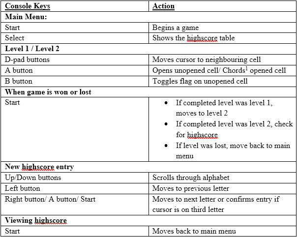
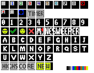

# Minesweeper_GBA

Coding a Minesweeper game for GBA

Done for project for NUS module ME3241 Microprocessors

## Setup

1. Load `.vhw` file in Visual HAM

1. Modify or make source code files within Visual HAM if necessary

1. Compile everything from command line by running `make` in the directory of the `.vhw`.

## Project details

Project involved creating a GBA game with the following conditions:

1. Game must have a start menu and the end of a game round should return to this menu

1. The game must use sprites

1. The game must use interrupts or timers

1. The game must use the console button scheme

1. The code should include some portion of Assembly, which can be called from the `main.c` file

1. The game should include more than 1 level, each level of increasing difficulty from the previous

## File details

### `main.c`:

Main file that runs the game loop. Handler keeps track of all timers and interrupts used for timekeeping and control inputs

___

### `game_logic.h`:

Used for checking win conditions and creating map on game start. Code implementation was dedicated to a fellow project member

___

### `cell_logic.h`:

Used for handling game behaviour when the player interacts with a cell.

___

### `controls.h`:

Control scheme of the buttons are designed here.

___

### `sprites.h`:

Images are drawn using sprites, which are designed in RGB format in the array

The array type was initially u16, given by the project coordinator, but could be safely changed to u8 to save on memory

___

### `assembly.c`:

The obligatory assembly portion. Details a single function that linearises a 2d array into a 1d array.

___

### `score.h`:

Used for handling the highscore section.

___

### `states.h`:

Used for handling state transition (e.g. main menu to new game).

___

### `draw.h`:

Used for drawing the chosen sprites on the screen, based on game state.

___

### `gba.h`:

Used to `#define` memory values used by GBA architecture

## Miscellaneous

* ARM7 instruction set is used for assembly portion.

* Project was done as a 2-man team.

* Coding other files as a `.h` header is not recommended, but was done anyways due to time constraints. 
As a result, the sequence of header loading under the main file is very specific and breaks if changed.